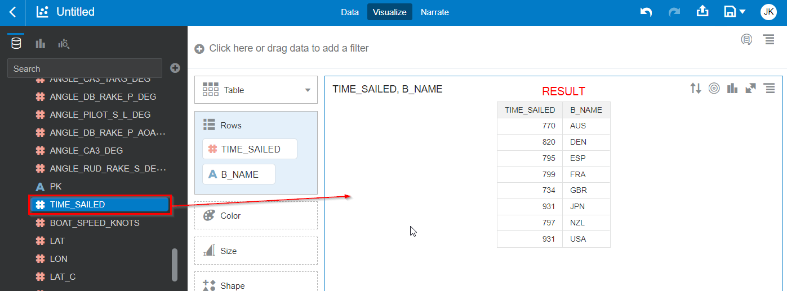
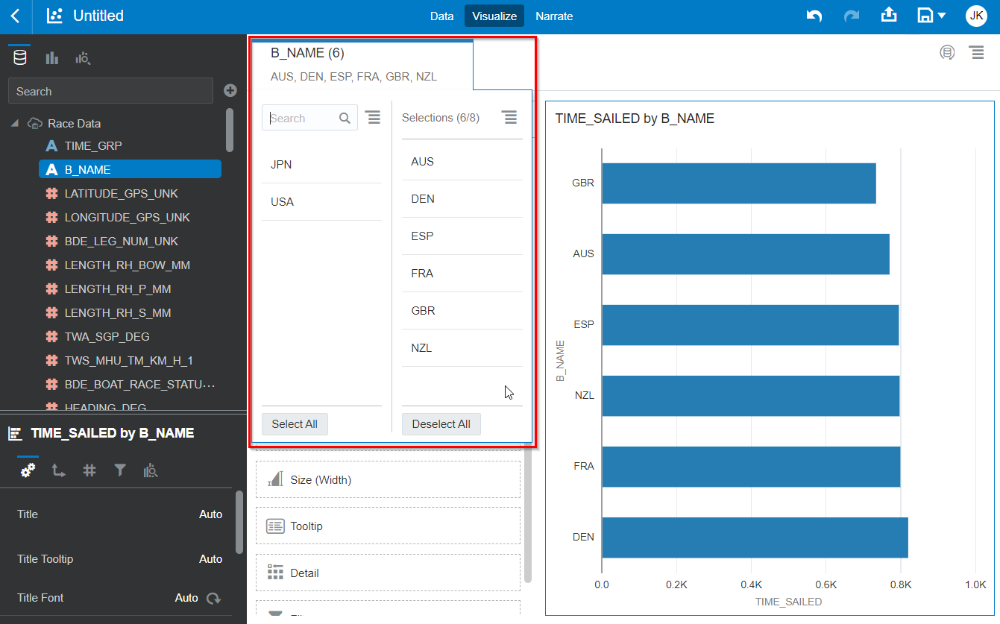
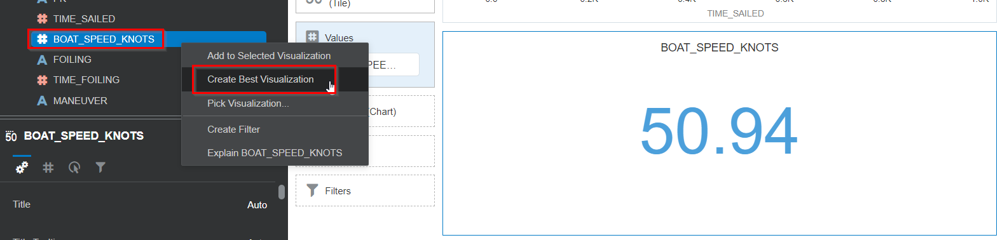
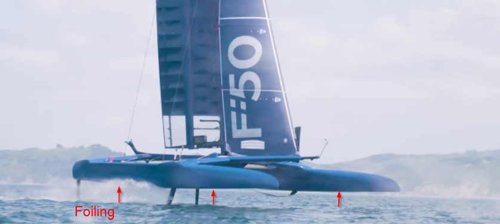
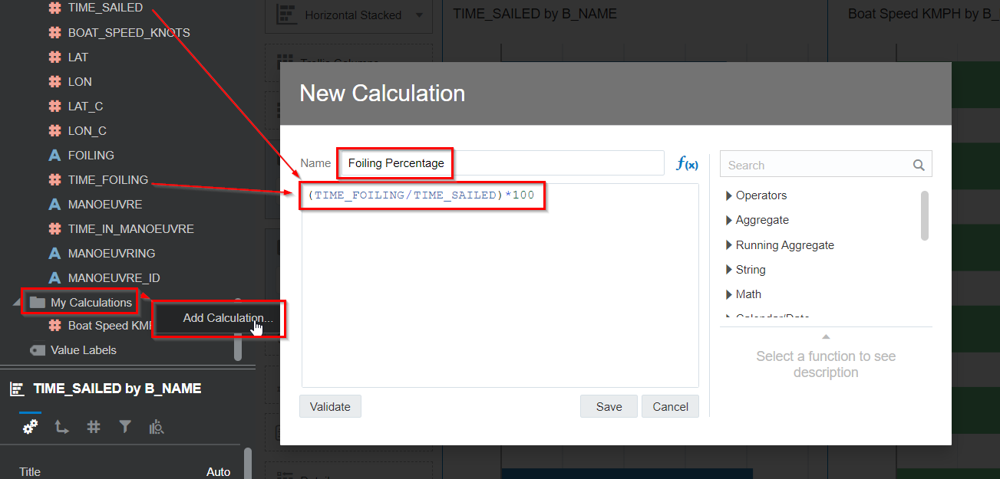
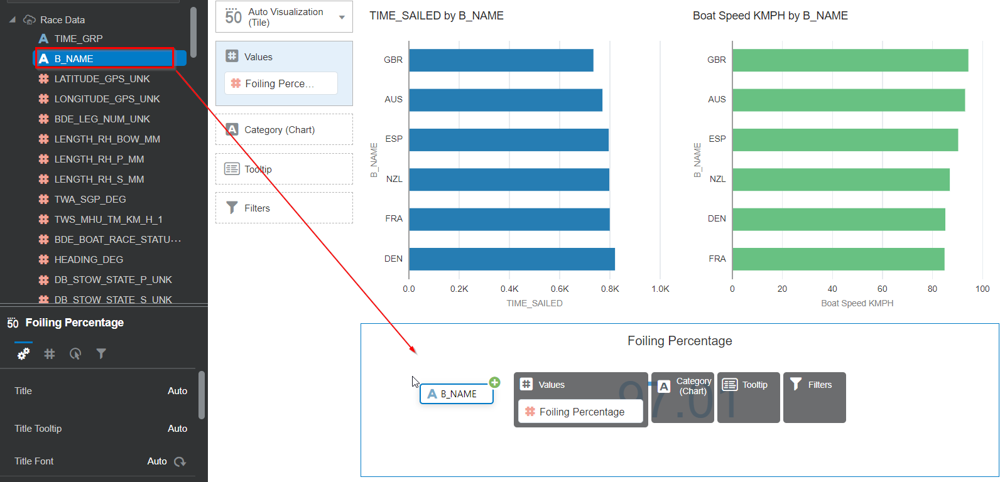

# SailGP Data Analysis

## Introduction

In this lab, you will get a taste of what it is to be a Data Athlete for SailGP! One of their jobs is to do a post-race analysis. The goal of such an analysis is to find out why one boat finishes before the other one. You'll do this by looking for clues in the data and calculate various performance metrics. The final goal of this is to help the sailing teams to perform better in the upcoming race!

In this lab we'll start with some basic statistics such as the time that it takes each team to finish the race, the maximum speed that the teams achieve and the amount of time that they are able to foil (let the boat rise out of the water).

The tool that will make this possible is **Oracle Analytics Cloud** (OAC), which will work on data that's stored and processed by **Oracle Autonomous Data Warehouse** (ADW).

<!--
[](youtube:Sf5MkI9pTn0)
-->

_Estimated Time:_ 15 minutes


### Objectives
In this lab, you will:

- Learn how a SailGP Data Athlete extracts valuable insights from sensor data
- Learn how to use Oracle Analytics Cloud to prepare and analyze data

### Prerequisites
This lab assumes you have:
- An Oracle Free Tier, Always Free, Paid or Live Labs Cloud Account
- Provisioned Oracle Analytics Cloud
- Provisioned Autonomous Data Warehouse
- Completed the previous lab


## Task 1: Find The Race Winners

1. Create a new Oracle Analytics Cloud Project by selecting Create and Project

   

2. Choose the dataset that was saved earlier called **Race Data** (double-click). You can also search for it in the search box.

   


2. Create a chart with race winners

   Let's start with our first visualization challenge: Find out who took the least time to go from start to finish by creating a chart on `B_NAME` (team name) and `TIME_SAILED` (the number of seconds they were sailing).

   Drag `B_NAME` to the canvas.

   

   Find the `TIME_SAILED` column and drag it to the canvas as well.

   

   The result should look like this. You have a simple table with the time that each team took to complete the race.

3. Let's make this a bit easier to interpret: Change the representation to **Horizontal Stacked Bar Chart**.

   

4. We want to see the fastest team first, so let's change the sorting. Click the **Sorting** icon (top right).

   

   Configure the sorting to be by `TIME_SAILED` from low to high. Click **OK**.

   

   We can see that Great Britain was the winner, followed by Australia.

5. Actually, Japan and the USA did not finish the race because they collided. Let's remove them from the outcome by adding a filter. Drag `B_NAME` to the filter area.

   

   Then configure the filter to include all countries apart from `JPN` and `USA`. You see how the chart now contains only the 6 remaining teams.

   

   You can see that the boats that finished last were France and Denmark, we will now compare France and Denmark to Great Britain to see how they are different. Hopefully we will find some indicators on where France and Denmark can make improvements.

## Task 2: Compare Maximum Boat Speeds

1. Find out which teams are able to obtain the maximum boat speed.

   Right click on the `BOAT_SPEED_KNOTS` field and choose **Create Best Visualization**.

   

   This shows the maximum speed across all boats in this race. In fact, this was a new record for all SailGP races so far! 51 knots per hour is over 94 kilometers per hour or 59 miles per hour!

2. Show what the maximum speeds are for all countries, by dragging `B_NAME` onto the same chart.

   

3. Change the chart type to **Horizontal Stacked**.

   

4. **Sort** the chart by boat speed, **High to Low**.

   
   

	 In this case, the teams that have the higher maximum speed also are the teams that are finishing highest. However we have to be careful drawing any conclusions from this. Remember, in sailing the highest speed doesn't necessarily mean the best track taken through the course, nor that you will be the winner.

   

## Task 3: Investigate How Much the Teams Are Foiling

1. Introduction

   Foiling is the phenomenon where boats go fast enough to rise out of the water. Because they rise of the water, they have less water resistance, resulting in even higher speeds. Because of this, teams will always try to foil as much as possible. Let's see how well the teams are able to foil.

	 

2. Create a calculation

   First create a calculation to calculate the percentage of time that teams are foiling. We can use the `TIME_SAILED` (total time to complete race) and `TIME_FOILING` for this. Add a calculation (right click on **My Calculations**) with the name `Foiling Percentage` and create the following formula. Remember that you can drag the fields in from the left to add them to the formula.

   It should look like this:

	 ```
   <copy>
   (TIME_FOILING / TIME_SAILED)*100
   </copy>
   ```

   

3. Create a basic chart

   Now create a chart to display the foiling percentage for all the teams. First, create a new chart with overall foiling percentage by right clicking on the new Foiling Percentage field and choosing **Create Best Visualization**.

   

4. Add the `B_NAME` column in the visualization to show the foiling percentage per team.

   

5. Change the chart type to **Horizontal Bar Stacked**.

   

6. Change the sorting to be on Foiling Percentage **High to Low**. Click **OK**.

   

   We can see that, although Denmark does a good job foiling, they are still the last team to cross the finish line.

   

7. Save the project with name `Basic statistics on Bermuda race 4`.

   

8. Go back to the **Home Page**.

   

Congratulations on completing this lab!

You may now *proceed to the next lab*.

## **Acknowledgements**
- **Author** - Jeroen Kloosterman (Technology Product Strategy Director), Victor Martin (Technology Product Strategy Manager)
- **Contributors** - Priscila Iruela, Arabella Yao
- **Last Updated By** - Arabella Yao, August 2021
