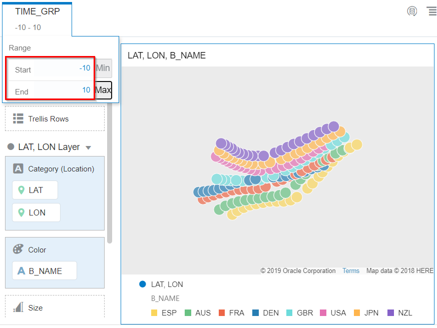
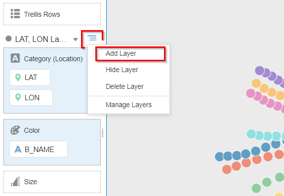
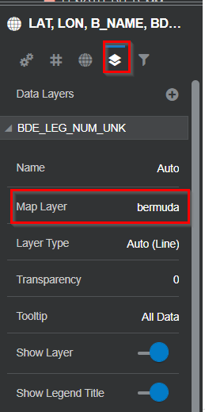
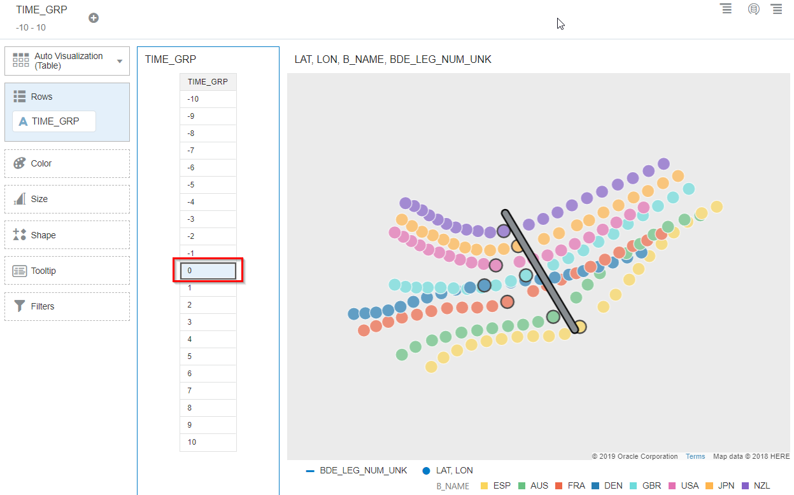
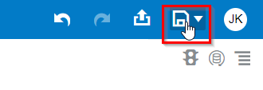

# SailGP Data Analysis

## Introduction

In this lab, you will continue your post-race analysis of the Bermuda race.

We will look closely at the **start** of the race. Often, who will win the race is decided in these crucial first moments. Teams want to position themselves as well as possible during the count down to the start signal. For example, they try to

- Be as close to the starting line when the race starts and,
- Have the highest possible speed when the race starts.

Our goal is to help the sailing teams to perform better in the upcoming race!

_Estimated Time:_ 10 minutes

### Objectives
In this lab, you will:

- Learn how a SailGP Data Athlete extracts valuable insights from sensor data
- Learn how to use Oracle Analytics Cloud to prepare and analyze data

### Prerequisites
This lab assumes you have:
- An Oracle Free Tier, Always Free, Paid or Live Labs Cloud Account
- Provisioned Oracle Analytics Cloud
- Provisioned Autonomous Data Warehouse
- Completed the earlier SailGP analytics Lab

 

## Task 1: Investigate Start Performance (Part 1)

<!--
To give you an impression, have a look at this video. You can see how teams are trying to get in the best possible position and with the highest speeds.

   
-->

Investigate proximity to the starting line at start signal.

Our goal is to visualize the boats on a map so that we can see how close the teams are to the starting line at the star signal. We will use the long/lat data we configured in the earlier lab to for this analysis.

1. Create a new Oracle Analytics Cloud Project by selecting Create and Project

   

2. Choose the dataset that was saved earlier called **Race Data** (double-click). You can also search for it in the search box.

   

3. Now we want to visualize our coordinates (comprised of Latitude and Longitude). **Select** the `LAT` and `LON` columns (use Control to select multiple columns). Then **drag** them to the right canvas.

   

   You should see the following:

   

4. We want to be able to distinguish the path of each team separately. Let's color-code each team. Drag the `B_NAME` column to the **Color** field.

   

5. This shows each team as a separate color. However, it's still a lot of data to digest. How do we zoom in on only the data that's relevant for that start? Let's filter the data to show only the first seconds of the race.

   Drag `TIME_GRP` to the Filter area.

   

6. Set the filter type to **RANGE**.

   

7. Choose only the 10 seconds before and after the start. In the filter parameters, **Start** will be `-10` and **End** will be `10`.

   

   This still isn’t perfect, because we cannot see the starting line. We have no context of the race course (starting line, marks, et cetera).

8. Our next task will be to bring in the geographical elements for starting line, marks, et cetera. First **Save** the project as `Performance analysis`.

   

<!-- 9. Then, go back to the **Home Page**.

   
-->
 

## Task 2: Investigate Start Performance (Part 2)

   Now we're ready to include the geographical elements such as starting line, waypoints and finish line.

2. With the `Performance analysis` project open click the ribbon icon next to the map configuration and choose **Add Layer**.

   

3. Drag the `BDE_LEG_NUM_UNK` column to the _Category (Location)_ field of the new layer.

   

4. Select the `bermuda` layer.

   

5. You should now see the starting line as follows:

   

6. Our next goal is to highlight the positions of the teams at the very start of the race.

	 Right click on the `TIME_GRP` column and select **Create Best Visualization**.

   

7. In the resulting table, click on the **0** to highlight the positions at `TIME_GRP` = 0.

   

   **Conclusion**: Already at the start, we see that the winner Great Britain is outperforming the other boats. Denmark and France could improve their timing on the start.
	 It indeed appears that the start is very important for the final result of the race. We also notice that Spain has crossed the starting line early, they actually received a penalty for this.

9. Save the project and go back to the Home Page.

   

<!--10. Bonus: Evaluate the speed of the teams at the very start of the race. Which teams have the highest speed? Which teams could try to improve their speed at the start in the next race?-->

Congratulations on completing this lab!

You may now *proceed to the next lab*.

## **Acknowledgements**
- **Author** - Jeroen Kloosterman (Technology Product Strategy Director), Victor Martin (Technology Product Strategy Manager)
- **Contributors** - Priscila Iruela, Arabella Yao
- **Last Updated By** - Arabella Yao, August 2021
