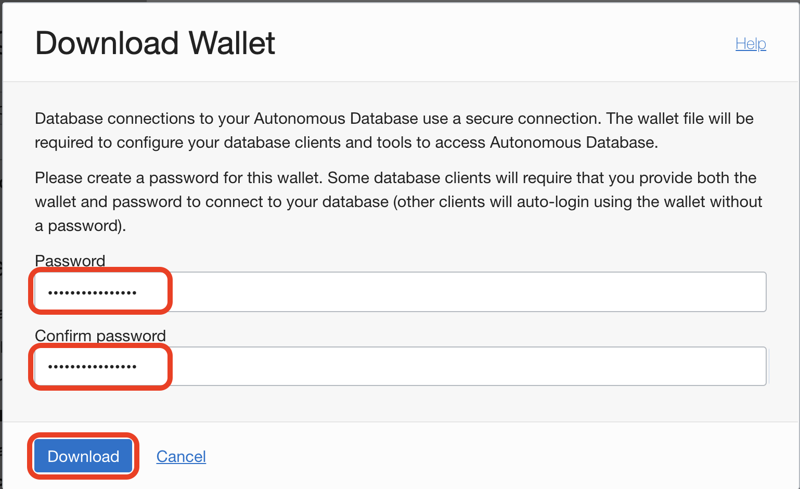
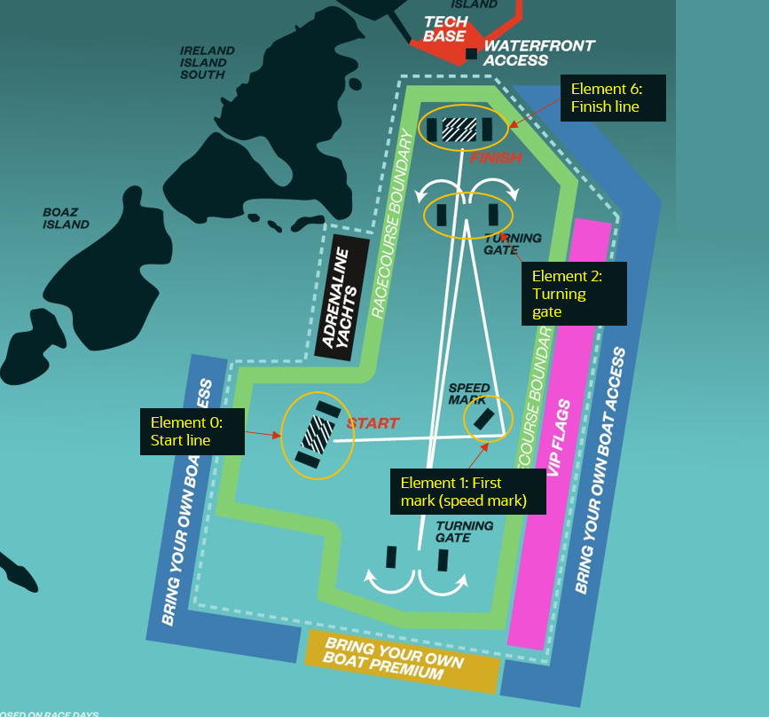
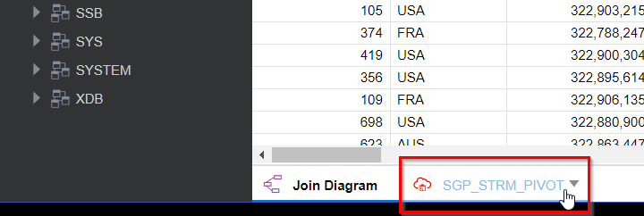
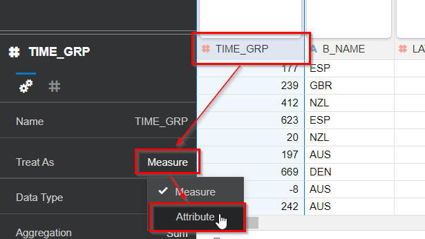
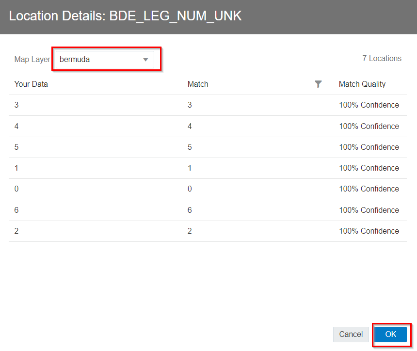

# SailGP Analytics Dataset

## Introduction

Before we start to do some data analysis on the SailGP data we must first connect **Oracle Analytics Cloud** (OAC) to the data stored in the **Autonomous Data Warehouse** (ADW). 

We will then create an OAC Dataset on the database table and make various changes to the dataset in order to correctly set up the data for the various tasks in the subsequent labs.

<!--

-->

_Estimated Time:_ 30 minutes

### Objectives
In this lab, you will:

- Learn how to create a dataset in Oracle Analytics Cloud
- Learn how to prepare the datasert and setup a custom map layer for subsequent analysis

### Prerequisites
This lab assumes you have:
- An Oracle Free Tier, Always Free, Paid or Live Labs Cloud Account
- Provisioned Oracle Analytics Cloud
- Provisioned Autonomous Data Warehouse

 

## Task 1: Create the Connection from Oracle Analytics Cloud to Autonomous Database

**Oracle Analytics Cloud** will be the tool which you use to analyze your data. **Autonomous Data Warehouse** is used to store and organize the data.
Therefore we need to create a connection from Oracle Analytics Cloud to Autonomous Data Warehouse first. To be able to create this connection, OAC will need to use a so-called "wallet" file. The wallet file (client credentials), along with the database user ID and password, provides access to your Autonomous Database in the most secure way possible. The "wallet" file can be obtained from the database menus.

1. In Oracle Cloud, click the **Navigation Menu** in the upper left, navigate to **Oracle Database**, and select **Autonomous Data Warehouse**.

	

   You can see all the **ADW** instances that you have **created**.
   **Select** the instance `SAILGP` that we created before.

   

2. We will download the wallet file. The wallet file (client credentials), along with the database user ID and password, provides access to your Autonomous Database in the most secure way possible.

   > **Note:** Store wallet files in a secure location. Share wallet files only with authorized users.

3. On the ADW detail page,click **DB Connection**.

   

4. Click **Download Wallet** on Database Connection side-screen. Leave  the default value `Instance Wallet` as the **Wallet Type**. Finally, click **Download Wallet**.

   

5. Type the password, confirm the password by typing it again and click **Download**.

      - Password: `Oracle_12345`
      - Confirm Password: `Oracle_12345`

   

  A `ZIP` file will start downloading to your local machine.

6. Use the Wallet in Oracle Analytics Cloud

   **Return** to the **Oracle Cloud Infrastructure console** and click on the menu icon on the left.

   Navigate to **Analytics & AI** and then **Analytics Cloud**.

   

7. **Open** the Cloud Analytics **URL** associated with your instance (the one that we created in Lab 2) by using the dots menu button on the right-hand side of your instance information and selecting **Analytics Home Page**.

   Make sure your Oracle Analytics Cloud instance is in status `Active` (not `Creating`) before you go to **Analytics Home Page**.

   Be patient, Analytics Cloud sometimes can take few more minutes to provision.

   

   The **Oracle Analytics** page will open in a new browser **window/tab**.

8. On the top right-hand side of the screen, click **Create**, and then **Connection**.

   

9. Choose **Oracle Autonomous Data Warehouse**.

   

   Use the following information to configure your **connection**.

    - Connection Name: `SAILGP`
    - Client Credentials: Use the Browse button to upload the **wallet ZIP file** that you downloaded (it will automatically extract the `cwallet.sso` file from this zip bundle)
    - Username: `sailgp`
    - Password: `Oracle_12345`
    - Service Name: Keep the default, the name of your database followed by the `_high` suffix

    

10. Select **Save** to save your new connection **information**.

 

## Task 2: Add a Geographical Map Layer of the SailGP Course
Later on in lab 6 we are going to analyse the race and visualise the boats on a map of Bermuda. We will add a custom map layer into Oracle Analytics Cloud in preparation for the analysis.

1. **Download** a file that contains all the geographical elements (such as starting line, waypoints and finish line) from <a href="https://objectstorage.eu-frankfurt-1.oraclecloud.com/p/XfJRoExhW_0WX_aspj4H1U2Ce8vDA45SRZFW_27KmXYRFXbyRNhjvvU98cB5FbVG/n/odca/b/workshops-livelabs-do-not-delete/o/sailgp_bermuda.geojson" target="\_blank">File with Bermuda geo elements</a> to your local machine. Depending on your browser, you may have to use Right Click. Make sure that the file is saved with extension `.geojson`.

2. From the ribbon on the **Home Page**, go to the Console.

   

3. Select Maps.

   

4. Choose **Add Custom Layer**:

   

5. Choose the file that you've just downloaded. Note the **Trackelement** field.

   This field in the file identifies each of the geographical elements with a number. This number corresponds to the leg to which the element belongs. For example, `trackelement=0` corresponds to the coordinates of the starting line, `trackelement=1` corresponds to the coordinates of the first waypoint after the start and `trackelement=6` corresponds to the coordinates of the finish line. See the image below for an explanation.

   

   Check the "Trackelement" field. Click **Add**.

   

 

## Task 3: Add the Dataset to Oracle Analytics Cloud

We're going to take a deep dive on the SailGP regatta that took place in Bermuda in April 2021. In particular, we are going to have a look at race 4 (out of 7 in total). We're going to do a post race analysis with the goal of helping the teams perform better in the upcoming race.

Earlier, we uploaded the data of this race to Autonomous Data Warehouse. Now, we have to make this available to Oracle Analytics Cloud.

1. On the top right, choose **Create** and then **Data Set**.

   

2. Select the `SAILGP` connection.

   

3. Open the `SAILOR` schema and **double click** on the `SGP_STRM_PIVOT` table.

   

   Each record in this data set represents one second of the race for one particular team.
   At each second of the race, we can see the values of many of the sensors of the boat of each team.

   You see how Oracle Analytics is profiling the columns in the data set. It creates histograms and other charts of each of the columns to quickly give you insight into what value there is in them. For example, have a look at column `B_NAME`. This shows you that there are 8 countries that are competing (column `B_NAME`). And have a look at `LENGTH_RH_BOW_MM`, Which shows you how far the boat lifts out of the water, the values appear to hover between 0 and 1.5m above the water.

   These graphs are a great way to quickly get an understanding of your data.

 

## Task 4: Configure the Oracle Analytics Cloud Dataset
We are going to make various changes to the dataset such as re-classifying various columns from a `MEASURE` (visible because of the # symbol) to an `ATTRIBUTE`.

4. Configure the details of the dataset

   Now at the bottom of the screen, click on `SGP_STRM_PIVOT` to configure the details of the dataset.

   

5. Modify `TIME_GRP` column

   This attribute contains the time in the race, in seconds. For example, -30 indicates 30 seconds before the start of the race. Value 0 indicates the start of the race, etc.

   Right now it is classified as a `MEASURE` (visible because of the # symbol). However, we will not use this attribute to calculate, therefore we will convert this into an `ATTRIBUTE`.

   Click the header of the `TIME_GRP` column, then click the value next to **Treat As** and change it to **Attribute**.

   

   The symbol next to the column header changes to `A`.

6. Find the `TIME_IN_MANEUVER` column (towards the end) and set **Treat As** to **Attribute**. 

   

7. **Pivot** the representation

   Pivot the presentation so it becomes easier to modify the column configuration.

   

8. Modify the **Aggregation** type of `BOAT_SPEED_KNOTS` (boat speed in knots)

   Later on, we will want to obtain the Maximum Boat Speed for each team. Because of this, we want to set the default aggregation of the `BOAT_SPEED_KNOTS` field to **Maximum**.

   Find the `BOAT_SPEED_KNOTS` column and click it, then change the aggregation to **Maximum**.

   

<!--
8. Modify the aggregation type of TWS_MHU_TM_KM_H_1 (wind speed)

   Similarly, later on we'll want to obtain the Average Wind Speed.
   Because of this, we want to set the default aggregation of the TWS_MHU_TM_KM_H_1 (wind speed) to "Average".

   Find the TWS_MHU_TM_KM_H_1 column and click it, then change the aggregation to "Average".

   
-->

9. Save the data set

   Finally, click the **Save** icon and give the data set a logical name, e.g. **Race Data**.

   

 

## Task 5: Configure the Oracle Analytics Cloud Dataset Geographical Co-ordinaate Data
In lab 6 we will visualise the boat race on a map using our data which contains the geographical coordinates (latitude + longitude) of each boat at each moment in the race. We first have to instruct Oracle Analytics Cloud to interpret our coordinate data.

1. Within the existing **Race Data** Dataset Find the `LATITUDE` column (towards the end), and change **Treat As** to **Attribute**.

   

2. Click on the ribbon next to the `LATITUDE` field and choose **Location Details**.

   

3. Make sure that the Location Details configuration is as follows. **It's important to press Ok, even if you don't make changes.**

   

   Next, do the same thing for the `LONGITUDE` column. Set the **Treat As** to **Attribute**.

   

   Change the Location Details to the following. **It's important to press Ok.**

   

4. Click on the save icon to save the current dataset.

 

## Task 6: Link the Oracle Analytics Cloud Dataset to the Geographical Data 

1. Let's link our dataset to the geographical data of the race course. We will do this by linking the leg number to the trackelement number that we uploaded in **Task 2**.
Click the `BDE_LEG_NUM_UNK` column (towards the end). This contains the current leg that each boat is sailing at a particular moment in time. Set **Treat As** to **Attribute**.

   

2. Next, go to the **Location Details** of this column.

   

3. Select the `bermuda` map to connect to this column. You will notice that the values in our data set ("Your Data") line up perfectly with the values in the map information that we uploaded earlier ("Match"). Click **OK**.

   

4. Go back to the **Home Page** and save the data set if you're being asked to.

   

Congratulations on completing this lab!

You may now *proceed to the next lab*.

## **Acknowledgements**
- **Author** - Jeroen Kloosterman (Technology Product Strategy Director), Victor Martin (Technology Product Strategy Manager)
- **Contributors** - Priscila Iruela, Arabella Yao
- **Last Updated By** - Arabella Yao, August 2021
